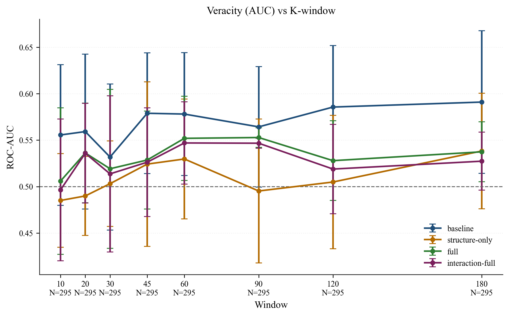
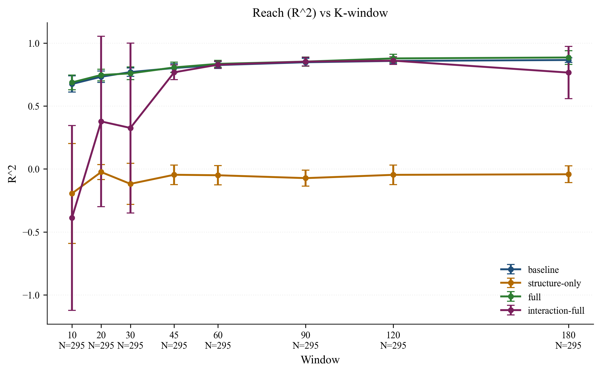

# Early Diffusion Signals for Predicting Reach and Veracity in Social Media Rumor Cascades

This repository reproduces the final thesis analysis. The current design uses FibVID as the main dataset, keeps Twitter15/16 as a comparative benchmark, treats size-based $k$-windows as the main specification, and reports time-window and native-graph analyses as supplementary checks.

## What the repository reproduces

The final analysis has four parts.

1. Twitter15/16 benchmark pipeline under the original rumor-tree format.
2. FibVID main analysis under a harmonized cascade-compatible representation.
3. FibVID time-window robustness analysis.
4. FibVID native graph analysis used as a supplementary veracity check.

The main paper conclusion from this pipeline is a task asymmetry: early diffusion is much more informative for eventual reach than for veracity. In the FibVID main analysis, reach is strong under the harmonized $k$-window design, while veracity remains modest and is better interpreted as weak risk screening rather than strong classification.

## Comparative snapshot

The repository still keeps a small visual comparison between the older Twitter15/16 benchmark outputs and the revised FibVID-centered analysis.

- In the original Twitter15/16 benchmark, veracity peaks around AUC `0.657`, while reach peaks around `R^2 = 0.719`.
- In the revised FibVID main analysis, veracity remains modest, but reach becomes even stronger under the harmonized $k$-window specification.

### Veracity comparison

Left: original Twitter15/16 benchmark output. Right: revised FibVID main analysis.

<p align="center">
  
  
</p>

### Reach comparison

Left: original Twitter15/16 benchmark output. Right: revised FibVID main analysis.

<p align="center">
  
  
</p>

## Main output locations

Running the full reproduction writes to two places.

- `thesis_outputs/`
  Twitter15/16 benchmark outputs from the original tree-based pipeline.
- `new data/`
  FibVID main outputs, time-window outputs, native-graph outputs, and cross-result summaries.

Important generated files include:

- `thesis_outputs/tables/results_k_primary.csv`
- `thesis_outputs/tables/permutation_test_k60.csv`
- `new data/tables/results_k_primary.csv`
- `new data/tables/results_timewin_primary_fibvid.csv`
- `new data/fibvid_graph_native/graph_veracity_results.csv`
- `new data/full_results_comparison.md`

## Data requirements

See `Data/README.md` for the expected folder layout.

The current full analysis expects both:

- Twitter15/16 tree files under `Data/rumor_detection_acl2017/`
- FibVID files under `merry555-FibVID-14b95c3/`

The FibVID scripts expect the following released tables:

- `merry555-FibVID-14b95c3/claim_propagation/claim_propagation.csv`
- `merry555-FibVID-14b95c3/news_claim/news_claim.csv`

## Environment

Python tested: `3.12.2`

Install dependencies:

```bash
python3 -m venv .venv
source .venv/bin/activate
pip install -r requirements.txt
```

`xgboost` is optional. The code falls back automatically when it is unavailable.

## Reproduce the final analysis

Use the top-level reproduction script:

```bash
bash reproduce.sh
```

This script runs, in order:

1. the Twitter15/16 benchmark pipeline,
2. the FibVID harmonized main pipeline,
3. the FibVID time-window comparison,
4. the FibVID native graph analysis.

If you only want one component, the direct entry points are:

```bash
python3 main.py --data_dir Data --out_dir thesis_outputs
python3 scripts/run_fibvid_main_pipeline.py
python3 scripts/run_fibvid_timewin_compare.py
python3 scripts/run_fibvid_graph_native.py
```

## Repository layout

```text
.
├── README.md
├── requirements.txt
├── reproduce.sh
├── main.py
├── scripts/
│   ├── run_fibvid_main_pipeline.py
│   ├── run_fibvid_timewin_compare.py
│   └── run_fibvid_graph_native.py
├── thesis_pipeline/
├── Data/
│   ├── README.md
│   └── rumor_detection_acl2017/
├── thesis_outputs/    # generated Twitter benchmark outputs
└── new data/          # generated FibVID outputs and comparison summaries
```

## Notes on scope

This repository is meant to reproduce the final implemented analysis, not every exploratory design considered during drafting. In the final paper:

- FibVID is the main empirical setting.
- Twitter15/16 remain as a comparative benchmark.
- Time windows are a robustness specification.
- The native graph analysis is supplementary and is mainly used to check veracity sensitivity to representation.

## Citation

Please cite this project using `CITATION.cff`.
